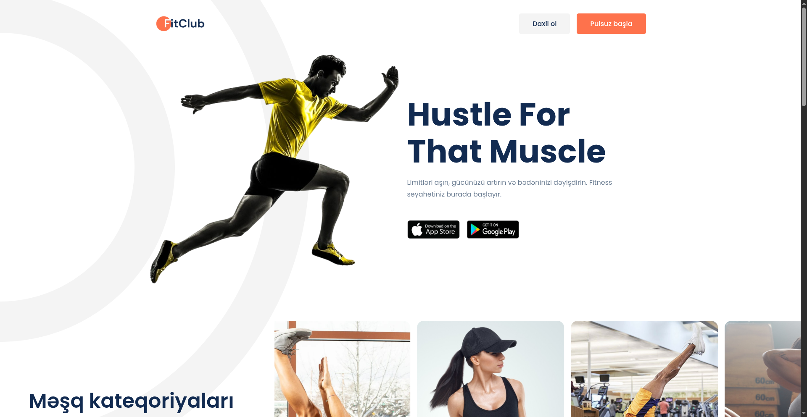
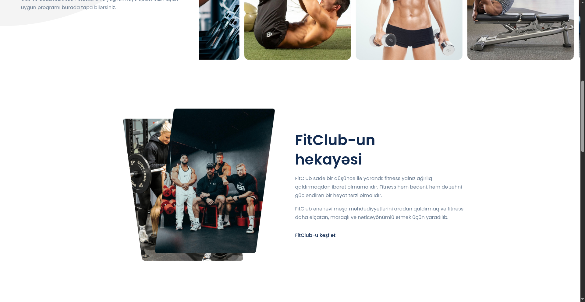
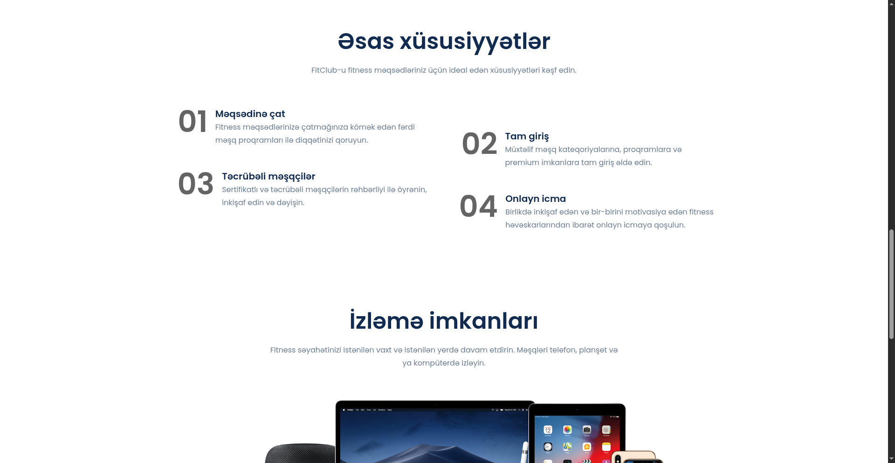
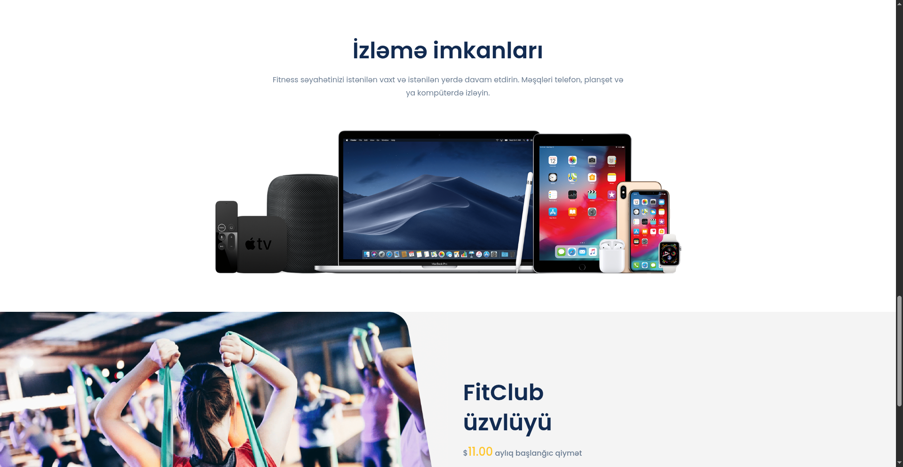
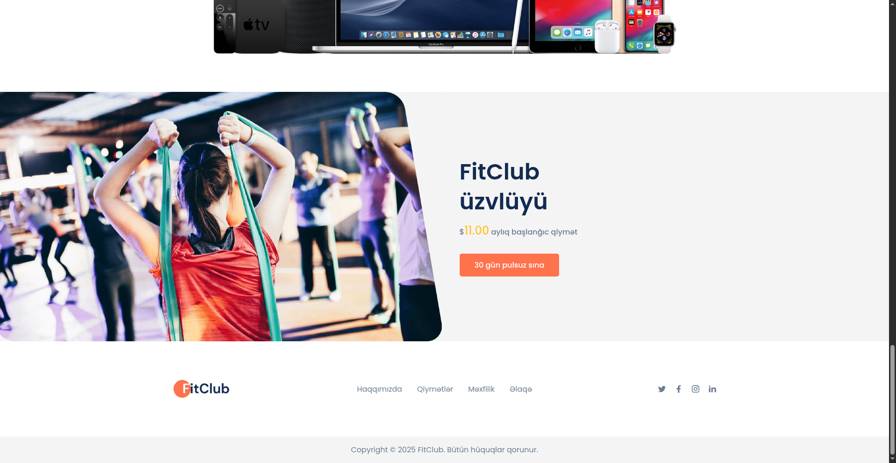

# FitClub

A responsive fitness landing page built with HTML, CSS, and JavaScript.

## Demo











**Live Demo:**  
https://fitclub-4jv.pages.dev/

## Features

- Responsive design
- Mobile navigation
- Workout sections
- Membership section
- Scroll animations
- Light and dark mode

## Technologies

- HTML5
- CSS3
- JavaScript
- ScrollReveal.js
- Poppins
- Remix Icon

## Theme

The project supports light and dark modes.

```javascript
lightMode();
darkMode();
toggleTheme();
```

The selected theme is saved with `localStorage`.

## Reference

Based on the Web Design Mastery tutorial:

Playlist:

https://www.youtube.com/playlist?list=...
